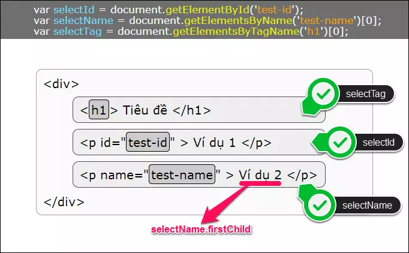

## Cách chạy project
1. Cài `nodejs`.
2. Cài yarn
```sh
npm i -g yarn
```
3. Chạy yarn để cài các dependencies
```sh
yarn
```

4. Dev
```sh
yarn dev
# Hoặc
yarn run next dev
```

5. Build

```
yarn build
```

6. Serve web
```
yarn start
```

7. Kết quả


## DOM

Document Object Model - DOM ("Mô hình Đối tượng Tài liệu"), là một giao diện lập trình ứng dụng (API). DOM được dùng để truy xuất các tài liệu dạng HTML và XML, có dạng một cây cấu trúc dữ liệu.


### HTML DOM

In HTML DOM (Document Object Model), every element is a node:

- A document is a document node.
- All HTML elements are element nodes.
- All HTML attributes are attribute nodes.
- Text inserted into HTML elements are text nodes.
- Comments are comment nodes.

### Cách javascript thông thường mutate HTML DOM


- `document.getElementById('id')`
- `document.getElementsByTagName('div')`
-` document.getElementsByName('tên_cần_tìm')`

### Nhược điểm khi mutate DOM
- The changes and updates to the DOM are fast because of its tree-like structure but re-rendering whole documents makes the DOM Slow.
- All UI components need to be re-rendered for every DOM update.

Do đó, cần có cách thay đổi, cập nhật giao diện tối ưu hơn => Đi tới Virtual DOM

## Virtual DOM

- VirtualDOM là cách React (hay Vue) sử dụng để cập nhật giao diện.
- VirtualDOM là cách tạo ra một mô hình DOM ảo, khi có update tới các phần tử trong VirtualDOM, nó sẽ thực hiện so sánh bằng thuật toán `diff` để tìm ra sự thay đổi và chỉ cập nhật các phần tử đó thay vì việc phải rerender cả page.

> Changing Virtual DOM should not be much different than changing the real DOM. The problem is in the aftermath: changes in real DOM trigger relayout and repaint, so the less we touch the real thing, the better.

## Cấu trúc thư mục Next

- Gồm các top level folders như
    - app: Chứa các App Router
    - pages: Chứa các Page Router
    - public: Chứa các file static
    - src: chứa mã nguồn

- Bên cạnh các top level folders, còn có các file quan trọng như

| next.config.js     | Configuration file for Next.js          |
|--------------------|-----------------------------------------|
| package.json       | Project dependencies and scripts        |
| instrumentation.ts | OpenTelemetry and Instrumentation file  |
| middleware.ts      | Next.js request middleware              |
| .env               | Environment variables                   |
| .env.local         | Local environment variables             |
| .env.production    | Production environment variables        |
| .env.development   | Development environment variables       |
| .eslintrc.json     | Configuration file for ESLint           |
| .gitignore         | Git files and folders to ignore         |
| next-env.d.ts      | TypeScript declaration file for Next.js |
| tsconfig.json      | Configuration file for TypeScript       |
| jsconfig.json      | Configuration file for JavaScript       |


## Routing trong next
- Next sử dụng cách routing dựa trên cấu trúc thư mục

```
├── pages
|  ├── index.js
|  ├── contact.js
|  └── my-folder
|     ├── about.js
|     └── index.js
```

Nếu nextjs được host ở local với port 3000, các routes sẽ được next tự tạo. Ví dụ 
- `index.js` nhận url là `http://localhost:3000`
- `contact.js` nhận url là `http://localhost:3000/contact`
- `my-folder/about.js` tương tự, thì sẽ nhận url `http://localhost:3000/my-folder/about`
